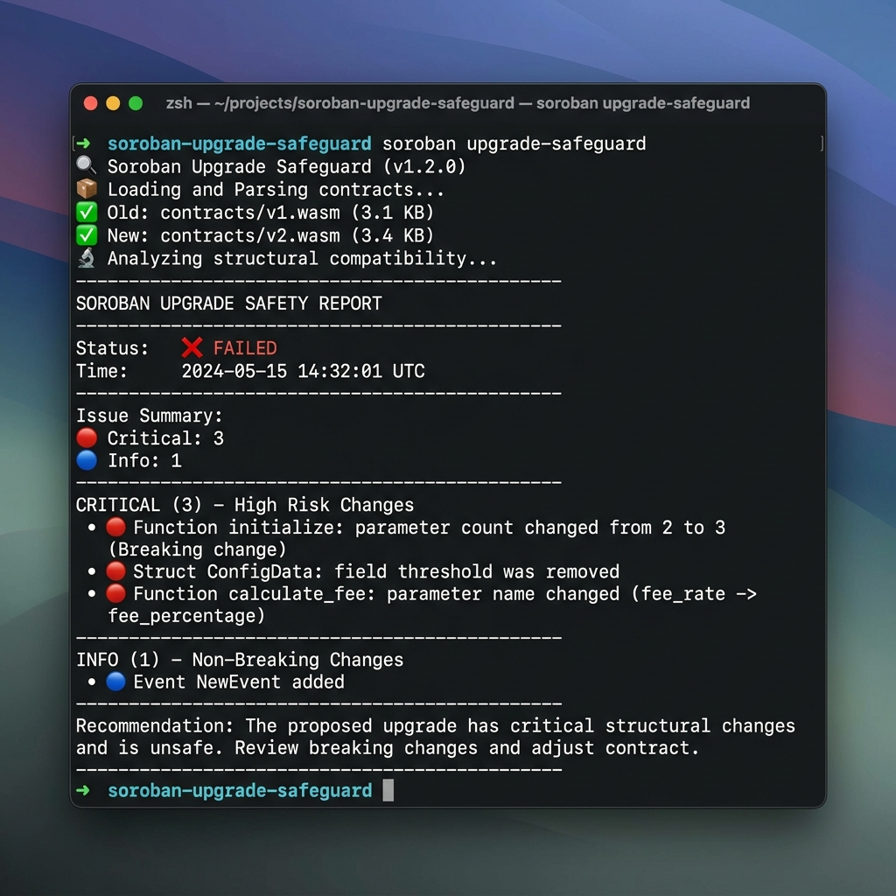

# Soroban Upgrade Safeguard 🛡️



A powerful CLI tool to analyze and validate Soroban smart contract upgrades on the Stellar network. It detects breaking changes in storage layout, function signatures, and event schemas before you deploy.

## Features

- **Storage Layout Protection**: Detects field removals, reorderings, and type changes in structs and enums that would corrupt on-chain data.
- **Function Signature Validation**: Flags changes in function names, parameters, and return types that break integration with existing clients/contracts.
- **Event Schema Analysis**: Heuristically identifies event-related types and ensures their structure remains backwards compatible for indexers.
- **Cascading Break Detection**: Uses dependency graphing to track how a change in a low-level type affects all parent structures.
- **Rich CLI Output**: Beautiful, color-coded reports with actionable severity levels (Critical, Warning, Info).
- **CI/CD Friendly**: Exits with a non-zero code if critical breaking changes are detected.

## Installation

```bash
cargo install --path .
```

## Usage

Compare two WASM contract builds to see if the upgrade is safe:

```bash
soroban-upgrade-safeguard <OLD_WASM> <NEW_WASM>
```

### Example

```bash
soroban-upgrade-safeguard ./wasm/v1.wasm ./wasm/v2.wasm
```

## How it Works

The tool parses the `contractspecv0` custom sections from both WASM files, decodes the XDR representations of the contract's interface, and performs a deep structural comparison. It builds a type dependency map to identify when a simple change in a shared struct might cascade into breaking multiple storage entries.

## Severity Levels

- **🔴 CRITICAL**: Breaking changes that WILL cause data corruption, serialization panics, or broken integrations. **Do not deploy.**
- **🟡 WARNING**: Changes that might affect external systems but won't necessarily corrupt local storage (e.g., adding elective parameters if supported).
- **🔵 INFO**: Informational logs about additions or non-breaking modifications.

## License

MIT
